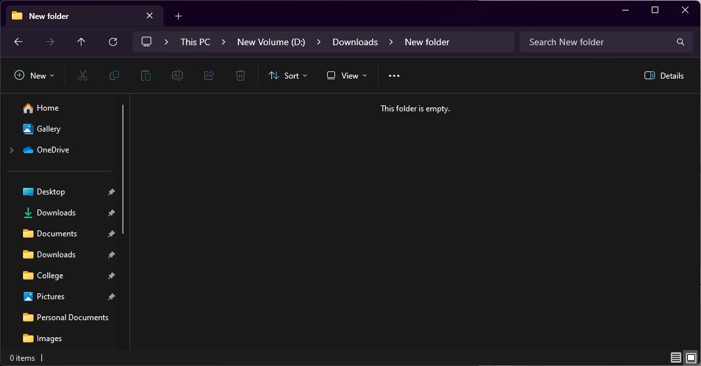
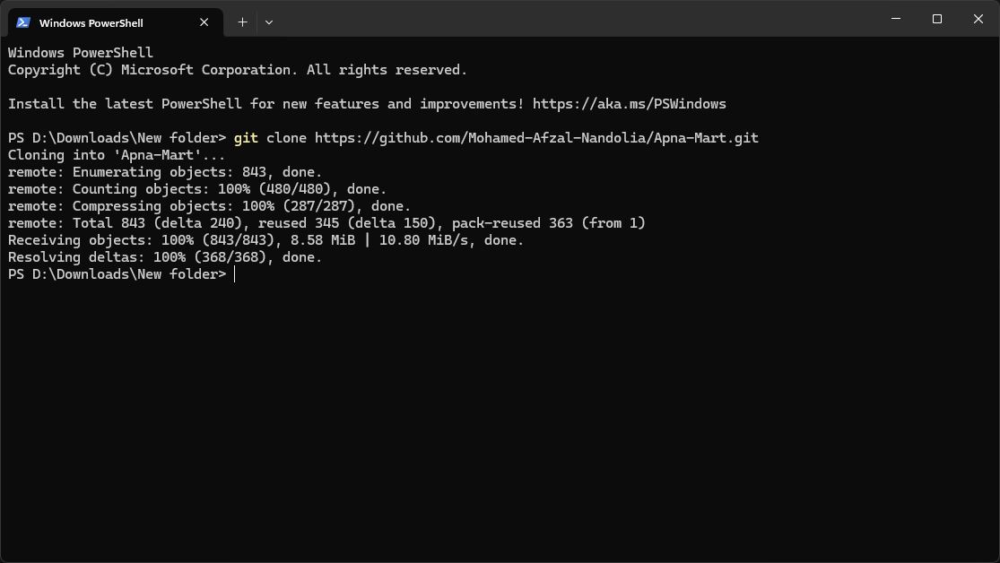
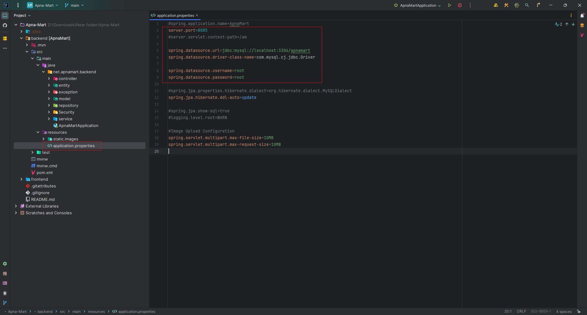

# Apna Mart

ApnaMart is an e-commerce platform designed for purchasing groceries and stationery items online.

## Tech Stack

**Frontend:** React, TailwindCSS

**Backend:** Spring Boot

**Database:** MySQL

## How to install

Install all the software required and proceed with the steps below.

### Required Softwares:

- **MySQL** (Server and Workbench)

- **IntelliJ IDEA Ultimate Edition** (as the free IntelliJ IDEA Community Edition does not have built-in support for Spring Boot. Also you will be required to have Java installed)

- **Visual Studio Code**

### Steps:

- Firstly, copy the HTTPS link from the repository.

- Then go to the directory you want this project in.

- Open Powershell/CMD in this directory.

- Type this and press enter:
  `git clone [link]`
  replace the [link] by the HTTPS link that you coppied in the first step.

- OR Copy and Paste this command (Paste on Powershell/CMD is done by right click) ->
  `git clone https://github.com/Mohamed-Afzal-Nandolia/Apna-Mart.git`
- You will get a folder name Apna-Mart in your directory

- Open Visual Studio Code and go to this directory:
  `\Apna-Mart\frontend`

changing the directory by using cd command

**Example:**

    cd Apna-Mart

    cd frontend

Run this command in the terminal:

    npm i
    npm run dev

**By using npm run dev command your frontend will start running successfully.**

Default port number is 3000.

http://localhost:3000

- Open MySQL Workbench and connect to your Local instance

Create a new SQL tab and type this command and run

`Create Database apnamart;`

On successful creation of the database it will look like this.

**Now that your MySQL is set, we can proceed with the backend.**

- Open IntelliJ IDEA Ultimate Edition and locate the project

- Then open it.

- After opening you will be asked to Load Maven dependencies, Simply load everything

- Open this file

`application.properties`

And change the configurations if you want.

You can change the server port number from here.

    server.port=8085

Make sure you port is set correctly in my case i have set it to 3306.

    spring.datasource.url=jdbc:mysql://localhost:3306/apnamart
    spring.datasource.driver-class-name=com.mysql.cj.jdbc.Driver

And this is the username and password of your MySQL which you need to set accordingly.

    spring.datasource.username=root
    spring.datasource.password=root

- Then simply open this file and run the project
  `ApnaMartApplication.java`

**Now you frontend, backend and database is running and you can start using it.**
